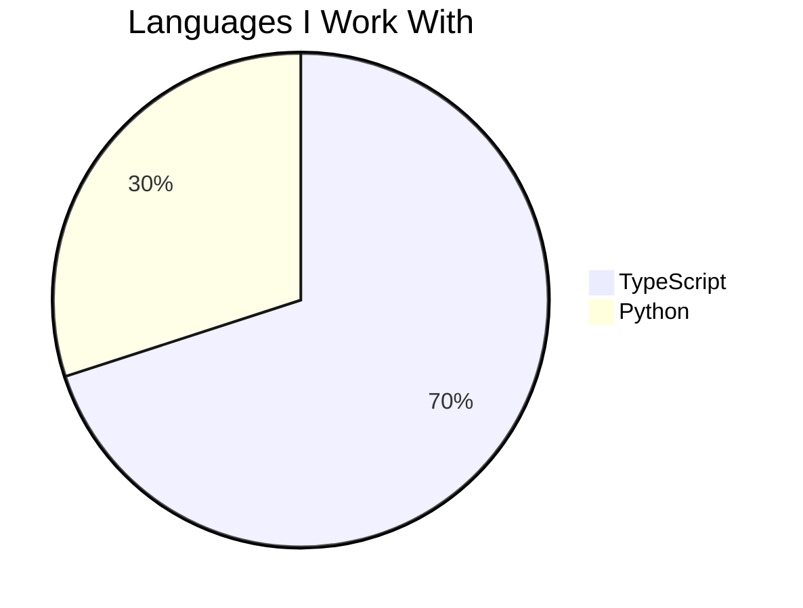

# Hey, I'm Shikhar 👋
Full Stack Developer · Open Source Contributor
---
### What I'm up to
- 🏗️ **Full Stack Developer** @ [Krane Apps](https://github.com/pskrane)
- 📚 **Fellow** @ [Internet Archive (OpenLibrary)](https://github.com/internetarchive/openlibrary) — migrating FastAPI endpoints
---
### Tech Stack

---
### Languages

---
### Projects
_Coming soon._
---
### Connect

